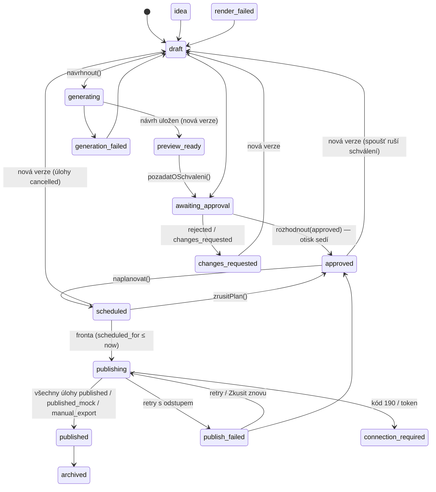

# Architektura

## 1. Rozhodnutí, na kterých to stojí

| Rozhodnutí | Proč | Kde |
|---|---|---|
| **Běžný Next.js 16 (App Router), server-first** | stejný framework jako FoodTab; obrazovky čtou data v server komponentách přes `withUser`, žádné API pro vlastní rozhraní | `app/` |
| **Vlastní schéma `marketing`** v Supabase Postgres | při vložení do FoodTabu se nic nepřejmenovává; `organizations`/`venues` se nahradí pohledy na `tenants`/`branches` | `supabase/migrations` |
| **PGlite pro vývoj a testy, postgres.js pro Supabase**, jedno rozhraní `Driver` | běh bez nastavení; PGlite s rolí `authenticated` bez superuser vynucuje RLS stejně jako Supabase | `lib/db/` |
| **Každý dotaz pod rolí `authenticated` s nastaveným uživatelem** | politiky RLS platí i při přímém připojení; `service_role` jen fronta a webhooky | `lib/db/session.ts` |
| **O přístupu rozhoduje jedno místo** `marketing.has_access(org, právo, provozovna)` | totéž pravidlo jako FoodTab; role jsou data organizace, ne kód | migrace zaklad, `lib/authz.ts` |
| **Poskytovatelé přes kategorie a schopnosti**, ne přes jména | nová služba = adaptér + řádek katalogu, žádné `if` v obrazovce; katalog nesmí předstírat adaptér (test) | `lib/providers/` |
| **Verze obsahu s otiskem, schválení vázané na otisk, hlídá databáze** | úprava po schválení nemůže projít ven; publish job bez schválení nevznikne ani přímým insertem | migrace obsah, `lib/domena/obsah.ts` |
| **Fronta v databázi, ne v paměti**; idempotentní klíče | přežije restart; opakování nikdy nevytvoří druhý příspěvek; spouští ji cron/n8n/tlačítko | `lib/domena/fronta.ts` |
| **Šablony jako data, render jako stroj** | brand kit se dosazuje za běhu; nová firma nepotřebuje grafika | `lib/sablony/katalog.ts`, `lib/render/svg-sablony.ts` |
| **Čas s povinným pásmem** | server na Vercelu běží v UTC; hodina na zdi provozovny se převádí přes pásmo provozovny, nikdy `new Date('…T18:00')` | `lib/cas.ts` |
| **Tajemství šifrovaná aplikací**, v DB jen ciphertext + otisk, přístup jen funkcemi | záloha databáze neobsahuje čitelný token; `authenticated` na tabulku nevidí | `lib/providers/credentials.ts`, migrace providery |
| **Mock je vždy vidět** | `published_mock`, `is_mock`, `isMock`, štítky; nikdy tichý mock v produkci | `lib/domena/stavy.ts`, adaptéry |
| **AI dostává jen to, co potřebuje**; fakta jen ze schváleného menu; brief je data, ne instrukce | pravidlo 8 FoodTabu (kontakty ne), ochrana proti podvrženým pokynům v menu | `sestavitZadani`, `lib/providers/ai/schema.ts` |
| **Doména bez HTTP a Reactu** (`lib/domena/*` bere `Tx`) | dá se volat ze server actions, z API v1 i z FoodTabu; testuje se přímo Nodem | `lib/domena/` |

## 2. Tok dat

```
  uživatel (prohlížeč, mobil 390 px)
      │  HTTPS, cookie session (demo HMAC / Supabase)
      ▼
┌────────────────────────────────────────────────────────────────┐
│ Next.js 16                                                      │
│  proxy.ts        obnoví Supabase cookie, přidá x-ftm-adresa     │
│  app/…           server komponenty + server actions             │
│  app/api/v1/…    REST pro n8n, FoodTab, cron, webhooky (píše se) │
│      │                                                          │
│      ▼  requireSession → nacistKontext (provozovna = návrh)     │
│  lib/authz.ts    assertAccess → marketing.has_access             │
│      │                                                          │
│      ▼  withUser(userId)  ── set role authenticated + jwt sub   │
│  lib/domena/     obsah · fronta · media · menu · utm · notifikace│
│      │                    │                                     │
│      │                    ▼                                     │
│      │   lib/providers/registry.ts  resolveProvider(kategorie)  │
│      │        │  read_secret → decryptCredentials               │
│      │        ▼                                                 │
│      │   adaptéry: ai/claude · ai/mock · render/svg · shotstack │
│      │             social/meta · mock · manual · workflow(n8n)  │
│      │                    │                                     │
│      ▼                    ▼                                     │
│  lib/db (Tx)       externí služby (HTTPS; média odkazem přes    │
│      │             podepsané adresy /api/v1/media/{id}/soubor)  │
└──────┼──────────────────────────────────────────────────────────┘
       ▼
  PostgreSQL, schéma marketing (RLS)          Storage (disk / Supabase bucket)
  PGlite lokálně · Supabase Frankfurt          jen server, servisní klíč

  fronta:  cron / n8n / tlačítko ─▶ POST /api/v1/ulohy/zpracovat
           ─▶ withService ─▶ zpracovatFrontu ─▶ adaptéry ─▶ publications
  webhooky: Shotstack / n8n / Meta / FoodTab ─▶ /api/v1/webhooky/* ─▶
           ověření podpisu (HMAC, okno 5 min) ─▶ webhook_events (idempotence)
```

Totéž jako mermaid (artefakty ho vykreslí; v editoru je to text):

```mermaid
flowchart LR
  U[Uživatel] -->|cookie session| N[Next.js app/ + server actions]
  N --> A[lib/authz.ts<br/>has_access v DB]
  A --> D[lib/domena/*]
  D --> R[lib/providers/registry.ts<br/>resolveProvider podle kategorie]
  R --> P[adaptéry: Claude · SVG · Shotstack · Meta · n8n · mock]
  P --> X[(externí služby)]
  D --> DB[(PostgreSQL schéma marketing, RLS)]
  D --> S[(Storage)]
  C[cron / n8n] -->|X-Cron-Secret| Q[/api/v1/ulohy/zpracovat]
  Q -->|withService| F[lib/domena/fronta.ts]
  F --> P
  X -->|podepsané webhooky| W[/api/v1/webhooky/*]
  W --> DB
```

## 3. Vrstvy a co v nich nesmí být

| Vrstva | Smí | Nesmí |
|---|---|---|
| `app/` | číst kontext, volat doménu v `withUser`, vykreslovat | rozhodovat o přístupu podle názvu role; volat adaptéry přímo; `new Date('…T18:00')` |
| `lib/authz.ts` | ptát se `has_access`; `muze()` jen pro schování tlačítka | být jedinou ochranou (RLS platí vždy) |
| `lib/domena/` | logika, transakce, audit, notifikace, `assertAccess` | vědět o HTTP, cookies, Reactu; logovat tajemství |
| `lib/providers/` | volat externí služby s dešifrovanými údaji z kontextu | ukládat údaje, vracet je do prohlížeče, tichý mock |
| `lib/db/` | přepnout roli, spustit migrace lokálně | používat práva `postgres` na data |
| databáze | RLS, spouště pro pravidla, funkce pro tajemství | spoléhat na to, že aplikace pravidlo nezapomene |

## 4. Stavový automat obsahu

Stavy a povolené přechody jsou v `lib/domena/stavy.ts` (`PRECHODY`);
tvrdá pravidla hlídá databáze (`guard_content_status`,
`on_content_version_insert`, `on_approval_decision`).

```
 idea ──► draft ──► generating ──► preview_ready ──► awaiting_approval ──► approved ──► scheduled ──► publishing ──► published
           ▲            │               │                  │   │              ▲            │             │  │
           │            ▼               ▼                  │   ▼              │            ▼             │  ▼
           │     generation_failed  (úprava = nová      │ changes_requested  │        (zrušení plánu)  │ publish_failed ──► retry / dead_letter
           │                          verze → draft)     │                    │                          │
           └──────────────────────────────────────────────┴────────────────────┴──────────────────────────┴─► connection_required
                                                                                                                (token vypršel)
 kdykoli: archived, cancelled          render selhal: render_failed → draft / preview_ready
```



Klíčová invarianta: **`approved`, `scheduled`, `publishing`, `published`
vyžadují `approved_version_id`**, a ten je vždy roven verzi, jejíž
otisk je v žádosti o schválení. Jakákoli nová verze ho vynuluje.

### Stavy publikační úlohy (`publish_jobs.status`)

`scheduled` → `queued` → `publishing` → `published` | `published_mock` |
`manual_export` | `failed` (→ retry) | `dead_letter` | `cancelled`.
Unikátní index `publish_jobs_one_live_idx` dovolí jen jednu živou úlohu
na verzi + kanál + formát + účet.

### Stavy render úlohy (`render_jobs.status`)

`queued` → `done` (synchronní SVG) nebo `submitted` → `rendering` →
`done` | `failed` (Shotstack přes polling/callback).

## 5. Verze obsahu a otisk

`content_versions` je neměnná řada (1, 2, 3…). Otisk
(`checksum`) = SHA-256 nad kanonickým JSON z `brief`, `inputs`,
`selected_variant_key`, `texts`, `storyboard`, `media_asset_ids`,
`cover_asset_id` — klíče seřazené, takže stejný obsah dá stejný otisk
bez ohledu na pořadí. Úprava beze změny otisku novou verzi nezaloží.

Žádost o schválení nese otisk; rozhodnutí nese otisk; spoušť odmítne,
když se kterýkoli liší od aktuální verze. Publish job nese otisk a
fronta ho před odesláním ověří ještě jednou.

## 6. Kde se co spouští

| Kdo | Co | Jak |
|---|---|---|
| uživatel | vše v rozhraní | server actions v `withUser` |
| cron / n8n / tlačítko | fronta | `POST /api/v1/ulohy/zpracovat` → `withService` |
| Shotstack | hotový render | callback → ověřit vlastním `GET /render/{id}` |
| n8n | výsledek workflow | `/api/v1/webhooky/n8n`, podpis HMAC |
| FoodTab | `menu.*` | `/api/v1/webhooky/foodtab`, podpis HMAC (etapa 3) |
| Meta | stav videa, odvolání | `/api/v1/webhooky/meta` (k ověření) |

## 7. Co se schválně neudělalo

- žádná fronta v paměti ani worker proces — Vercel funkce jsou
  krátkodobé, stav je v databázi,
- žádný vlastní editor grafiky — šablony jsou data,
- žádné čekání na člověka uvnitř n8n execution,
- žádný scraping webů kvůli menu — menu se zadá, importuje, nebo
  přijde z FoodTabu.
